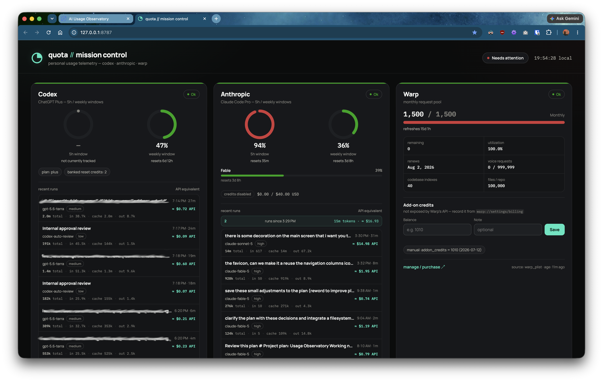
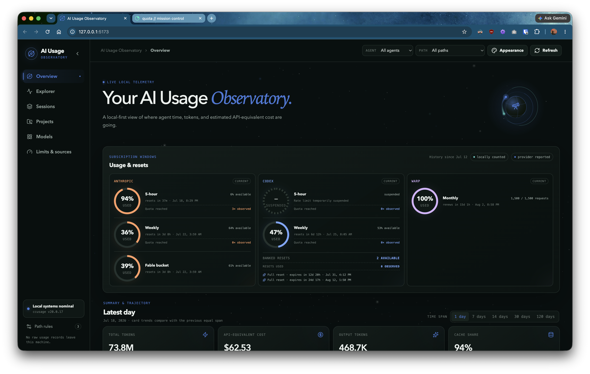

# quota-service


A local-first, read-only usage and quota tracker for Codex, Claude Code, and optional Warp usage. Use it from the command line for a current quota report, or connect its MCP server to an agent that needs live quota context. The browser dashboard is an optional, bare-bones interface.

## What it provides

- Live quota collection for Codex and Anthropic; optional manual Warp credit tracking.
- A CLI for usage, reset windows, cost estimates, and model recommendations.
- An MCP server exposing the same live usage, reset, estimation, and recommendation context to agents.
- A compact credit ledger and expandable Sources / Provenance view that keeps
  live provider data, imported Claude Web credit details, and local run
  telemetry visibly distinct.
- A localhost dashboard and JSON endpoints.
- A local SQLite history of collected snapshots.

All provider collection is read-only. The service does not consume credits, purchase anything, or write to provider systems.

## Requirements

- macOS: collectors use the macOS Keychain and Warp preferences.
- [Bun](https://bun.sh/).
- Existing local sign-in for the providers you enable.

## Quick start

```bash
git clone https://github.com/anobjectn/quota-service.git
cd quota-service
bun install
cp .env.example .env

# Print the current usage report.
bun run quota
```

The default providers are `codex,anthropic`. To include Warp, edit `.env`:

```dotenv
QUOTA_PROVIDERS=codex,anthropic,warp
QUOTA_PORT=8787
# History retention in days (default 90). Snapshot/reset-credit rows older than
# this are pruned on the poll cycle; the latest row per provider is always kept.
# Lowering this shortens the history any consumer (e.g. ai-usage-observatory)
# can see.
QUOTA_RETENTION_DAYS=90
```

## CLI

The CLI is the fastest way to check current allowance windows, reset times, and available headroom. It collects live data when needed and can emit JSON for scripts and other local tools.

```bash
# Machine-readable quota report and reset windows.
bun run quota json
bun run quota resets json

# Estimate a task and recommend a provider/model based on current headroom.
bun run quota estimate feature
bun run quota recommend large_refactor
```

Representative output (the percentages, reset times, and available providers reflect your own accounts):

```text
$ bun run quota
quota — generated 2026-07-19T00:36:19.977Z

Codex      [OK]          age: 7s ago  source: codex_api
  5h window:     not currently tracked
  weekly window: 1.0%  resets in 6d 23h
  plan: plus
  banked reset credits available: 1

Anthropic  [OK]          age: 7s ago  source: anthropic_api
  5h window:     85.0%  resets in 4h 13m
  weekly window: 11.0%  resets in 2d 8h
```

> **Historical note — Codex 5-hour window:** On or near July 12, 2026, OpenAI suspended the Codex 5-hour window while it studies how to best gauge and meter service usage. `not currently tracked` reflects that suspension, not zero remaining quota or a collection failure. See the [public announcement](https://x.com/thsottiaux/status/2076365965915467978).

```text
$ bun run quota resets
resets — generated 2026-07-19T00:36:19.977Z

Codex      weekly     1.0%  resets in 6d 23h
Anthropic  fiveHour   85.0%  resets in 4h 13m
Anthropic  weekly     11.0%  resets in 2d 8h

Codex banked reset credits: available=1 total_earned=2 [ok]
  - Weekly reset credit (available) expires 2026-08-01T00:00:00.000Z
```

```text
$ bun run quota estimate feature
estimate — feature: Standard feature work — moderate ambiguity, several files.
  rubric tier: mid
  light      21,000 – 91,000 tokens (typical ~52,500)
  mid        30,000 – 130,000 tokens (typical ~75,000)
  frontier   39,000 – 169,000 tokens (typical ~97,500)
```

```text
$ bun run quota recommend large_refactor
recommend — large_refactor (rubric tier: frontier)
  -> anthropic / Fable 5 / Opus 4.8
  reason: Task profile "large_refactor" maps to rubric tier "frontier". anthropic has the most headroom among frontier-tier options — recommend Fable 5 / Opus 4.8.
```

For scripts, append `json` to return structured data:

```text
$ bun run quota estimate large_refactor json
{
  "taskProfile": "large_refactor",
  "rubricTier": "frontier",
  "tokenRangeByTier": {
    "frontier": { "low": 130000, "typical": 260000, "high": 455000 }
  }
}
```

## MCP server

Run the stdio MCP server to give an MCP-capable agent access to current quota context:

```bash
bun run mcp
```

It exposes `get_usage`, `get_resets`, `estimate_cost`, and `recommend_model`. Each usage and recommendation read refreshes provider data best-effort, so agents can account for current headroom without a separately running web service.

Example tool calls and returned context:

```text
get_usage({})
→ Codex: weekly window 1.0% used, resets in 6d 23h
→ Anthropic: 5h window 85.0% used, resets in 4h 13m

estimate_cost({ taskProfile: "feature" })
→ rubric tier: mid
→ mid-tier estimate: 30,000–130,000 tokens (typical 75,000)

recommend_model({ taskProfile: "large_refactor" })
→ recommendation: anthropic / Fable 5 / Opus 4.8
→ reason: highest reported frontier-tier headroom
```

MCP results are JSON text, so an agent can inspect full provider status, data age, reset timestamps, alternatives, and warnings rather than relying only on the summary above. See [HOW-TO-USE.md](HOW-TO-USE.md) for Codex and Claude Code registration examples.

## Optional web dashboard

For a localhost view of the same data, start the dashboard at `http://127.0.0.1:8787/`:

```bash
bun run serve
```



> **Why the Codex 5-hour ring is blank:** On or near July 12, 2026, OpenAI suspended the Codex 5-hour window while it studies how to best gauge and meter service usage. The blank ring reflects that suspension, not zero remaining quota or a collection failure. See the [public announcement](https://x.com/thsottiaux/status/2076365965915467978).

## Local data and credentials

The repository ignores `.env`, `data/`, and SQLite database files. Collected snapshots are stored locally in `~/.quota-service/quota.db` by default. Provider credentials are read from existing local Codex and macOS Keychain sources and are not persisted by this service.

## Pair with AI Usage Observatory

For a fuller local usage dashboard, use quota-service alongside [AI Usage Observatory](https://github.com/anobjectn/ai-usage-observatory). AI Usage Observatory adds coding-activity, session, project, and cost views while optionally consuming quota-service's provider allowance and reset data.


